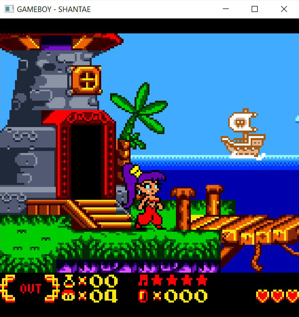

# gameboi

[](https://travis-ci.com/emrsmsrli/gameboi)
[](https://github.com/emrsmsrli/gameboi/blob/master/LICENSE)
[](https://github.com/emrsmsrli/gameboi/releases)
[](https://codecov.io/gh/emrsmsrli/gameboi)

gameboi is a Gameboy Color emulator written in Modern C++. Main goals of this project are 
writing understandable, modern C++ and not sacrificing performance, 
and learning about software & hardware architectures while doing so. 
This emulator does not have the best accuracy, but things mostly work.

### Features

gameboi does not aim to be the perfect emulator, 
so features are limited compared to other emulators.

- CPU, PPU and APU emulation
- Accurate internal timer
- Cartridge save-load capability
- Cartridge RTC support
- Link support
- Debugger and disassembler

## Screenshots

<p align="center">
    
    
</p>
<p align="center">
    
    
</p>
<p align="center">
    
</p>

## Code example

gameboi-core library can be easily integrated to your own frontend implementation:
```cpp
#include <gameboy/gameboy.h>

// automatically defined with cmake argument -DWITH_DEBUGGER=ON
#if WITH_DEBUGGER
#include <debugger/debugger.h>
#endif //WITH_DEBUGGER

void on_render_line(const uint8_t line_number, const gameboy::render_line& line) noexcept;
void on_vblank() noexcept;
void on_audio(const gameboy::apu::sound_buffer& sound_buffer) noexcept;

int main(int argc, char** argv) 
{
    // gameboy writes cartridge save files to disk 
    // when it goes out of scope
    gameboy::gameboy gb{"file/path/to/rom.gbc"};

#if WITH_DEBUGGER
    gameboy::debugger debugger{gb};
#endif //WITH_DEBUGGER

    gb.on_render_line(gameboy::connect_arg<&on_render_line>);
    gb.on_vblank(gameboy::connect_arg<&on_vblank>);
    gb.on_audio_buffer_full(gameboy::connect_arg<&on_audio>);

    while(true) {
        // gb.press_key(gameboy::key::a);
        // gb.release_key(gameboy::key::start);

        gb.tick_one_frame();
        // or gb.tick(); which executes only one instruction every iteration

#if WITH_DEBUGGER
        debugger.tick();
#endif //WITH_DEBUGGER
    }

    return 0;
}
```

## Build Instructions

### Dependencies

Install dependencies however you like. Though, `vcpkg` or `conan` might come in handy.
This is an example script for Ubuntu, using vcpkg:

- CMake (required version is 3.12.4)
- GTest (required if building tests)
- spdlog
- fmt
- SFML
- SDL2
- magic-enum
- cxxopts

```shell script
$ git clone https://github.com/Microsoft/vcpkg.git
$ cd vcpkg
$ ./bootstrap-vcpkg.sh -disableMetrics
$ ./vcpkg integrate install
$ ./vcpkg install gtest spdlog fmt sfml sdl2 magic-enum cxxopts
$ sudo apt install cmake ninja-build
```

### Building from source

gameboi uses CMake and can be easily built with a script like below.

```shell script
$ mkdir build
$ cd build
$ cmake -G Ninja --config Release ..
$ cmake --build -- -j $(nproc)
```

### CMake arguments

gameboi offers several CMake flags for build configuration. 
Check out [FLAGS.md](cmake/FLAGS.md) for more detailed information.

#### WITH_DEBUGGER

Enables debugger project to be built. Debugger currently depends on SFML so you need to supply it.

#### ENABLE_TESTING

Enables test project to be built. 
gameboi uses blargg's and mooneye's test roms to verify correctness of the emulation.
Currently most tests fail but games mostly work. \
You can run tests with `ctest` after building. \
You can also add more tests to the path `gameboycore/test/executable/path/res` if you want.

## Known Issues

Check _Issues_ tab. 
